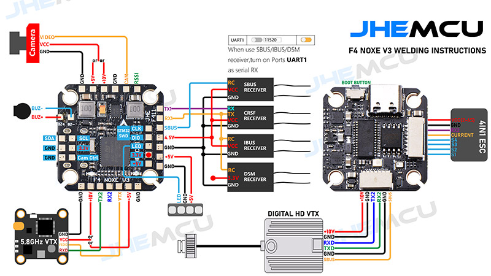

# NOXE V3 (JHEF-JHEF411) Pinout Reference

Complete pin mapping for JHEF F4 NOXE V3 flight controller (STM32F411CEU6).

**Source**: JHEMCU F4 NOXE V3 wiring diagram (welding instructions)
**Generated Config**: `extras/betaflight_converter/output/JHEF-JHEF411.h`
**MCU**: STM32F411CEU6 (100 MHz, 512KB Flash, 128KB RAM)

---

## Wiring Diagram



*JHEMCU F4 NOXE V3 welding instructions showing peripheral connections, motor outputs, receiver interfaces, and video system wiring.*

---

## Board Overview

The NOXE V3 is a compact 20x20mm flight controller designed for micro FPV drones with integrated features:
- **IMU**: Dual gyro support (MPU6000, ICM42688P)
- **OSD**: Integrated MAX7456 OSD chip
- **ESC Connection**: 4-in-1 ESC interface with UART telemetry
- **VTX/Camera**: Analog video switching and power control
- **Blackbox**: Onboard SPI flash (W25Q128FV, 16MB)

---

## Peripheral Pin Assignments

### SPI Flash (W25Q128FV - 16MB)
**Bus**: SPI2
**Frequency**: 8 MHz

| Function | Pin | Notes |
|----------|-----|-------|
| MOSI | PB15 | SPI2_MOSI |
| MISO | PB14 | SPI2_MISO |
| SCK | PB13 | SPI2_SCK |
| CS | PB2 | GPIO chip select |

**Usage**: Blackbox logging, configuration storage (LittleFS)

---

### IMU (MPU6000 / ICM42688P)
**Bus**: SPI1
**Frequency**: 8 MHz (IMU), 1 MHz (interrupt)

| Function | Pin | Notes |
|----------|-----|-------|
| MOSI | PA7 | SPI1_MOSI |
| MISO | PA6 | SPI1_MISO |
| SCK | PA5 | SPI1_SCK |
| CS | PA4 | GPIO chip select |
| INT | PB3 | EXTI3, data ready interrupt |

**Supported Sensors**:
- MPU6000 (6-axis, SPI)
- ICM42688P (6-axis, SPI, TDK InvenSense)

**Interrupt**: Rising edge on data ready, 1 kHz gyro sampling

---

### I2C1 (Environmental Sensors)
**Bus**: I2C1
**Frequency**: 400 kHz (Fast Mode)

| Function | Pin | Notes |
|----------|-----|-------|
| SCL | PB8 | I2C1_SCL |
| SDA | PB9 | I2C1_SDA |

**Typical Usage**: Barometer (BMP280), magnetometer, external sensors

---

### Motor Outputs (5 Motors)

#### TIM1 Bank - Motors 1, 2, 3
**Timer**: TIM1 (Advanced Control Timer)
**Protocol**: DSHOT300, DSHOT600, Multishot, OneShot125
**Frequency**: Varies by protocol (typically 1-8 kHz for PWM)

| Motor | Pin | Timer/Channel | Notes |
|-------|-----|---------------|-------|
| Motor 1 | PA8 | TIM1_CH1 | Standard output |
| Motor 2 | PA9 | TIM1_CH2 | Standard output |
| Motor 3 | PA10 | TIM1_CH3 | Standard output |

#### TIM3 Bank - Motors 4, 5
**Timer**: TIM3 (General Purpose Timer)
**Protocol**: DSHOT300, DSHOT600, Multishot, OneShot125

| Motor | Pin | Timer/Channel | ALT Variant | Notes |
|-------|-----|---------------|-------------|-------|
| Motor 4 | PB0 | TIM3_CH3 | **PB0_ALT1** | Requires ALT1 for TIM3_CH3 (AF2), default is TIM1_CH2N (AF1) |
| Motor 5 | PB4 | TIM3_CH1 | No ALT needed | Direct TIM3_CH1 mapping |

**CRITICAL**: Motor 4 (PB0) requires `PB0_ALT1` variant to select TIM3_CH3 instead of default TIM1_CH2N complementary output.

**PeripheralPins.c mapping**:
```c
{PB_0,      TIM1, STM_PIN_DATA_EXT(STM_MODE_AF_PP, GPIO_PULLUP, GPIO_AF1_TIM1, 2, 1)}  // TIM1_CH2N (complementary)
{PB_0_ALT1, TIM3, STM_PIN_DATA_EXT(STM_MODE_AF_PP, GPIO_PULLUP, GPIO_AF2_TIM3, 3, 0)}  // TIM3_CH3 (normal)
```

**BoardConfig usage**:
```cpp
static constexpr Channel motor4 = {PB0_ALT1, 3, 0, 0};  // ✅ Correct
// NOT: {PB0, 3, 0, 0};  // ❌ Wrong - would configure TIM1_CH2N
```

---

### UART Ports

#### USART1 - ESC Telemetry / Serial RX
**Baud Rate**: 115200 (configurable)
**Usage**: ESC telemetry (DSHOT), serial receiver, GPS

| Function | Pin | Notes |
|----------|-----|-------|
| TX | PB6 | USART1_TX |
| RX | PB7 | USART1_RX |

**Typical Connection**: 4-in-1 ESC telemetry (DSHOT bidirectional), CRSF/ELRS receiver

#### USART2 - Serial RX / Telemetry
**Baud Rate**: 115200 (configurable)
**Usage**: Serial receiver, telemetry (SmartPort, FrSky)

| Function | Pin | Notes |
|----------|-----|-------|
| TX | PA2 | USART2_TX |
| RX | PA3 | USART2_RX |

**Wiring Diagram Note**: When using SBUS/IBUS/DSM receivers, connect to UART1 RX. CRSF/ELRS receivers can use RX and TX for bidirectional communication.

---

### ADC (Battery Monitoring)

**ADC**: ADC1
**Resolution**: 12-bit (0-4095 counts)
**Reference**: 3.3V

| Function | Pin | ADC Channel | Divider | Voltage Range |
|----------|-----|-------------|---------|---------------|
| Battery Voltage | PA0 | ADC1_IN0 | 11:1 | 0-36V (3S-6S LiPo) |
| Battery Current | PA1 | ADC1_IN1 | 17:1 | 0-180A typical |

**Calibration**:
- Voltage divider: 11:1 (110:10 resistor ratio)
- Current sensor: 17:1 scale (170:10)
- Betaflight config: `set vbat_scale = 110`, `set ibat_scale = 170`

---

### Video System (Analog FPV)

#### Camera Connection
**Camera Connector** (Right side):
- **5V**: Regulated 5V output for camera
- **GND**: Ground
- **VIDEO**: Analog video input from camera

#### VTX Connection (5.8GHz Video Transmitter)
**VTX Connector** (Bottom):
- **VBAT**: Battery voltage direct (unregulated)
- **GND**: Ground
- **VIDEO**: Analog video output to VTX
- **TX** (Orange): UART TX for SmartAudio/Tramp VTX control
- **RX** (Yellow): UART RX (typically not used for VTX)

**Integrated OSD**: MAX7456 chip overlays flight data on video signal before sending to VTX

---

### ESC Connection (4-in-1 ESC Interface)

**Connector**: 10-pin header (bottom of board)

**From Wiring Diagram** (left to right based on pinout):
| Signal | Description | Notes |
|--------|-------------|-------|
| SBUS | SBUS receiver input | Serial bus protocol (inverted UART) |
| GND | Ground | Common ground with ESC |
| TX | UART TX | Motor signal 1 / DSHOT |
| RX | UART RX | Motor signal 2 / DSHOT |
| CRSF | CRSF receiver input | Crossfire/ELRS protocol |
| GND | Ground | Additional ground |
| SBUS | Duplicate SBUS (parallel) | For daisy-chaining |
| RX | Motor signal 3 | DSHOT / PWM |
| TX | Motor signal 4 | DSHOT / PWM |
| GND | Ground | Additional ground |

**Note**: Motor signals are typically sent as DSHOT (digital protocol) over these UART/timer pins. The "RX/TX" labels on ESC connectors refer to the direction from the ESC's perspective.

**Motor Mapping** (from JHEF-JHEF411.h):
- Motor 1: PA8 (TIM1_CH1)
- Motor 2: PA9 (TIM1_CH2)
- Motor 3: PA10 (TIM1_CH3)
- Motor 4: PB0 (TIM3_CH3, ALT1 required)
- (Motor 5: PB4 - not typically connected to 4-in-1 ESC)

---

### Serial Receivers (SBUS/IBUS/DSM/CRSF)

**Receiver Types Supported**:

| Protocol | UART | Pins | Baud | Notes |
|----------|------|------|------|-------|
| SBUS | UART1 | PB7 (RX) | 100000 | Inverted UART - requires external inverter or software inversion |
| IBUS | UART1 | PB7 (RX) | 115200 | Standard UART |
| DSM/DSMX | UART1 | PB7 (RX) | 115200 | Spektrum satellite |
| CRSF/ELRS | UART1 | PB6 (TX), PB7 (RX) | 420000 | Bidirectional, full telemetry |

**IMPORTANT - SBUS Signal Inversion**:
- **STM32F411 does NOT have hardware UART inversion capability**
- SBUS protocol requires inverted UART signal (logic levels flipped)
- **NOXE V3 Solution**: Dedicated SBUS input pad with **onboard hardware inverter**
  - The wiring diagram shows a separate SBUS receiver connector
  - Hardware inverter circuit (typically a single transistor or NOT gate) between SBUS pad and UART1 RX (PB7)
  - This allows direct connection of SBUS receivers without external inverter

**Wiring Diagram Shows**:
- **SBUS Receiver** → Connect to dedicated **SBUS pad** → Hardware inverter → UART1 RX (PB7)
- **IBUS/DSM Receiver** → Connect to IBUS/DSM pads → Direct to UART1 RX (PB7, no inversion)
- **CRSF Receiver** → Connect to CRSF pad → UART1 TX/RX (PB6/PB7, bidirectional)

**Signal Path**:
```
SBUS Receiver → [SBUS Pad] → [Hardware Inverter] → PB7 (UART1_RX) → MCU
IBUS Receiver → [IBUS Pad] → [Direct Connection] → PB7 (UART1_RX) → MCU
```

**Note**: The presence of a dedicated SBUS connector in the wiring diagram indicates onboard hardware inversion, which is standard on modern flight controllers to support SBUS receivers without external modules.

---

### LEDs

#### Status LED (Onboard)
**Pin**: PC13
**Type**: Active low (LED turns on when pin is LOW)
**Usage**: System status, arming indicator, error codes

**Typical States**:
- Solid: Disarmed
- Flashing: Armed
- Pattern: Error codes (e.g., no gyro, no RX)

---

### Boot Button

**Location**: Top right of board (labeled "BOOT BUTTON")
**Function**: DFU bootloader entry
**Usage**: Hold during power-up to enter DFU mode for firmware flashing via USB

---

### SWD Debug Interface

**Protocol**: Serial Wire Debug (SWD)
**Location**: Row of 5 solder pads visible in wiring diagram

From the wiring diagram, the visible pad row shows:

| Pad Label | Function | Pin | Notes |
|-----------|----------|-----|-------|
| CLK | SWCLK | PA14 | Serial Wire Debug Clock |
| DIO | SWDIO | PA13 | Serial Wire Debug I/O (bidirectional data) |
| LED | LED/Status | - | Possibly status LED connection |
| 3.3V | 3.3V Power | - | 3.3V power rail access |
| +5V | 5V Power | - | 5V power rail access |

**Note**: For SWD programming, you need at minimum:
- **CLK** (PA14 - SWCLK)
- **DIO** (PA13 - SWDIO)
- **GND** (ground connection, may be on separate pad/connector)

**Typical Use**:
- **ST-Link V2/V3**: Standard STM32 debugger (connect GND, CLK, DIO)
- **J-Link**: Advanced debugger with RTT support (used in HIL testing)
- **Black Magic Probe**: Open-source GDB-compatible debugger

**Programming Methods**:
1. **SWD (Recommended)**: Full debug capability, breakpoints, memory inspection
   - Requires: GND, SWCLK (CLK), SWDIO (DIO)
   - Optional: 3.3V for powering board from debugger
2. **DFU**: USB bootloader (hold BOOT button, no external hardware needed)

**HIL Testing Note**: When using NUCLEO-F411RE to emulate NOXE V3, the onboard ST-Link (reflashed to J-Link) provides SWD access via PA13/PA14. These pins are NOT available for GPIO use during debugging.

**Minimal SWD Connection** (Debugger → FC):
```
ST-Link/J-Link          NOXE V3 Pads
┌──────────┐           ┌─────────┐
│ GND      ├───────────┤ GND     │ (find ground pad/pin)
│ SWDIO    ├───────────┤ DIO     │ (PA13)
│ SWCLK    ├───────────┤ CLK     │ (PA14)
└──────────┘           └─────────┘
```

**Pin Conflict Warning**: PA13/PA14 are dedicated SWD pins. Do NOT reconfigure as GPIO unless debugging is not needed (will prevent firmware updates via SWD).

---

### Current Sensor

**Location**: Bottom right module (labeled "CURRENT")
**Type**: Hall effect or shunt-based current sensor
**Connection**: Inline with battery positive lead
**Output**: Analog voltage proportional to current → PA1 (ADC1_IN1)
**Calibration**: Scale factor 170 (17:1) for typical 0-180A range

---

## Power Distribution

### Input Power
- **VBAT**: 2S-6S LiPo (7.4V - 25.2V)
- **Current Rating**: Typically 20A continuous (board), ESC rating higher

### Regulated Outputs
- **5V**: Camera, receiver, peripherals (typically 1-2A capacity)
- **3.3V**: MCU, sensors, internal (not exposed)

### Power Pads (from wiring diagram)
- **VBAT**: Battery voltage input (ESC connector + VTX)
- **5V**: Regulated 5V output (camera connector)
- **GND**: Ground pads (multiple locations)

---

## Timer Allocation Summary

| Timer | Channels Used | Function | Pins |
|-------|---------------|----------|------|
| TIM1 | CH1, CH2, CH3 | Motors 1-3 | PA8, PA9, PA10 |
| TIM3 | CH1, CH3 | Motors 5, 4 | PB4, PB0 (ALT1) |
| SPI1 | - | IMU | PA5, PA6, PA7 |
| SPI2 | - | Flash | PB13, PB14, PB15 |
| USART1 | - | ESC/RX | PB6, PB7 |
| USART2 | - | RX/Telemetry | PA2, PA3 |
| I2C1 | - | Sensors | PB8, PB9 |
| ADC1 | IN0, IN1 | Battery V/I | PA0, PA1 |

---

## Pin Mapping Table (Complete)

| Pin | Arduino | Primary Function | Alternate Function | Timer/ADC | Connector |
|-----|---------|------------------|-------------------|-----------|-----------|
| PA0 | - | Battery Voltage | ADC1_IN0 | ADC1_IN0 | Current sensor |
| PA1 | - | Battery Current | ADC1_IN1 | ADC1_IN1 | Current sensor |
| PA2 | - | USART2 TX | - | - | Serial pad |
| PA3 | - | USART2 RX | - | - | Serial pad |
| PA4 | - | IMU CS | SPI1_NSS | - | IMU module |
| PA5 | - | IMU SCK | SPI1_SCK | - | IMU module |
| PA6 | - | IMU MISO | SPI1_MISO | - | IMU module |
| PA7 | - | IMU MOSI | SPI1_MOSI | - | IMU module |
| PA8 | - | Motor 1 | TIM1_CH1 | TIM1_CH1 | ESC pad |
| PA9 | - | Motor 2 | TIM1_CH2 | TIM1_CH2 | ESC pad |
| PA10 | - | Motor 3 | TIM1_CH3 | TIM1_CH3 | ESC pad |
| PB0 | - | Motor 4 | TIM3_CH3 (ALT1) | TIM3_CH3 | ESC pad (requires ALT1) |
| PB2 | - | Flash CS | GPIO | - | Flash chip |
| PB3 | - | IMU INT | EXTI3 | - | IMU module |
| PB4 | - | Motor 5 | TIM3_CH1 | TIM3_CH1 | Aux pad (optional 5th motor) |
| PB6 | - | USART1 TX | - | - | ESC telemetry |
| PB7 | - | USART1 RX | - | - | Receiver |
| PB8 | - | I2C1 SCL | - | - | I2C pad |
| PB9 | - | I2C1 SDA | - | - | I2C pad |
| PB13 | - | Flash SCK | SPI2_SCK | - | Flash chip |
| PB14 | - | Flash MISO | SPI2_MISO | - | Flash chip |
| PB15 | - | Flash MOSI | SPI2_MOSI | - | Flash chip |
| PC13 | - | Status LED | GPIO | - | Onboard LED |

---

## Physical Layout (from wiring diagram)

### Top View (Component Side)
```
        [BOOT BUTTON]
    ┌─────────────────────┐
    │  ○     [MCU]     ○  │
    │      [GYRO]         │  ← IMU module (MPU6000/ICM42688P)
    │  ○   [FLASH]     ○  │  ← SPI flash chip
    │                     │
    │  [5.8GHz VTX] ───┐  │  ← VTX connector (left side)
    │                     │
    │  [CAMERA] ───────┐  │  ← Camera connector (right side)
    └─────────────────────┘
         [ESC PADS]         ← Bottom: 4-in-1 ESC connection
```

### Connectors
- **Left Side**: 5.8GHz VTX (video out, power)
- **Right Side**: Camera (video in, 5V, GND)
- **Bottom**: ESC interface (10-pin header)
- **Top**: Boot button

---

## Comparison: NOXE V3 vs NUCLEO-F411RE

Key differences for HIL testing:

| Feature | NOXE V3 (JHEF411) | NUCLEO-F411RE | Compatible? |
|---------|-------------------|---------------|-------------|
| MCU | STM32F411CEU6 | STM32F411RET6 | ✅ Same family |
| Flash/RAM | 512KB/128KB | 512KB/128KB | ✅ Identical |
| SPI Flash Bus | SPI2 (PB15/14/13/2) | SPI3 (current) | ✅ Rewire to SPI2 |
| IMU SPI Bus | SPI1 (PA7/6/5/4) | SPI1 (PA7/6/5/4) | ✅ Identical |
| IMU INT | PB3 (Arduino D3) | PC4 (Morpho) | ✅ Rewire to PB3 |
| Motor Pins | PA8/9/10, PB0/4 | All available | ✅ All on Arduino headers |
| ALT Variant | PB0_ALT1 needed | Supported | ✅ Variant system |

**Conclusion**: NUCLEO-F411RE can fully emulate NOXE V3 pinout with minor rewiring.

See `doc/JHEF411_NUCLEO_COMPATIBILITY.md` for complete rewiring guide.

---

## References

- **Wiring Diagram**: JHEMCU F4 NOXE V3 welding instructions
- **Betaflight Config**: `extras/betaflight_converter/data/JHEF-JHEF411.config`
- **Generated Header**: `extras/betaflight_converter/output/JHEF-JHEF411.h`
- **Nucleo Config**: `targets/NUCLEO_F411RE_JHEF411.h`
- **STM32F411 Datasheet**: [DS9716](https://www.st.com/resource/en/datasheet/stm32f411re.pdf)
- **JHEMCU Product Page**: Check manufacturer for official documentation

---

## Notes for Developers

1. **Motor 4 ALT Variant**: Always use `PB0_ALT1` to select TIM3_CH3. Using `PB0` will configure TIM1_CH2N (complementary output), which won't work for DSHOT/PWM motor control.

2. **DSHOT Protocol**: Motors support DSHOT300/600 (digital ESC protocol). For HIL testing, use PWM mode (1 kHz) to enable input capture validation.

3. **SPI Frequency**: Flash runs at 8 MHz, IMU at 8 MHz (SPI) and 1 MHz (interrupt). Breadboard HIL testing may require lower frequencies (1 MHz) due to jumper wire capacitance.

4. **I2C Pull-ups**: Onboard pull-ups present for I2C1. External sensors may need additional pull-ups depending on bus length.

5. **ADC Calibration**: Battery voltage/current scales (110, 170) are specific to NOXE V3 hardware. Adjust for different sensor hardware.

6. **USB Bootloader**: F411 supports DFU mode via USB. Hold BOOT button during power-up, then use `dfu-util` or STM32CubeProgrammer for flashing.

7. **SBUS Signal Inversion**: STM32F411 lacks hardware UART inversion. SBUS requires external hardware inverter (transistor on FC) or software bit manipulation in firmware. CRSF/ELRS use standard UART.

8. **Video System**: Analog video path (camera → MAX7456 OSD → VTX) not needed for basic HIL testing. Focus on storage, IMU, and motor validation.
